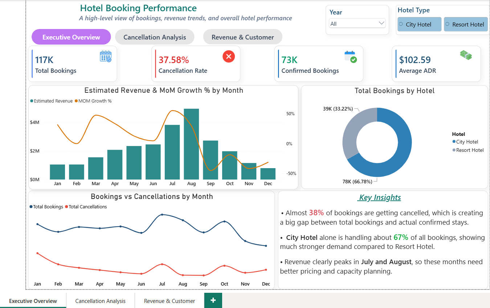
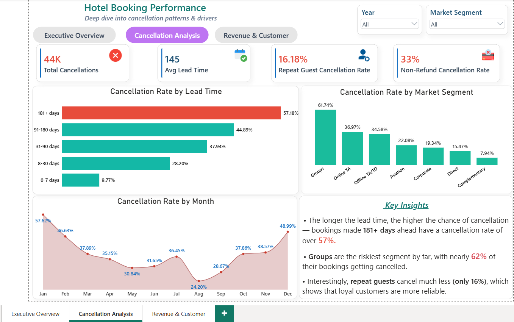
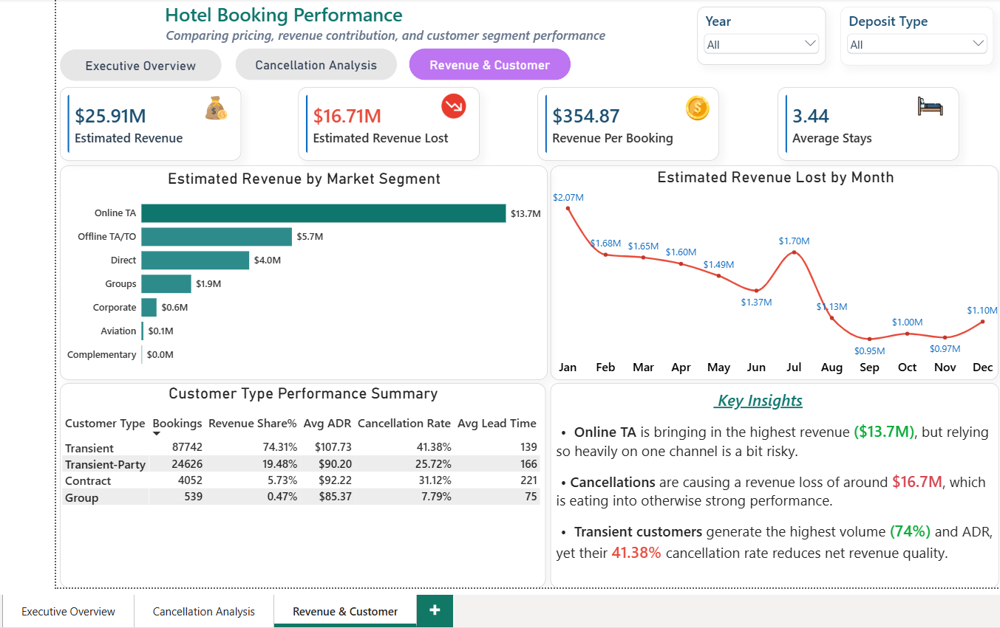

# 🏨 Hotel Booking Performance & Cancellation Analysis

**End-to-end data analysis project** covering 116,959 hotel bookings (2015–2017) across City Hotel and Resort Hotel properties in 178 countries, using **SQL (PostgreSQL)** for analysis and **Power BI** for visualization — with a focus on cancellation drivers, ADR trends, and customer segment performance.

---

## 📑 Table of Contents

- [Project Overview](#-project-overview)
- [Business Problem](#-business-problem)
- [Key Business Questions Explored](#-key-business-questions-explored)
- [Dataset](#-dataset)
- [Tools & Tech Stack](#️-tools--tech-stack)
- [Screenshots](#-screenshots)
- [Key Findings](#-key-findings)
- [Business Recommendations](#-business-recommendations)
- [Repository Structure](#-repository-structure)
- [How to Run](#️-how-to-run)
- [Connect With Me](#-connect-with-me)

---

## 📌 Project Overview

This project analyzes hotel booking data spanning 2015–2017 from two hotel types — City Hotel and Resort Hotel — covering more than 116,000 bookings across multiple countries.

Using **SQL (PostgreSQL)** and **Power BI**, I explored cancellation patterns, ADR trends, customer behavior, and market segment performance — and translated the findings into practical business recommendations.

---
## 📌 Business Problem

High cancellation rates are a real problem for hotels — they affect revenue, room planning, and day-to-day operations. This project looks at what's actually driving cancellations across two hotel types, and what patterns exist in booking behavior, market segments, and pricing. The goal is to find practical ways to reduce cancellations and improve revenue performance.

---

## ❓ Key Business Questions Explored

1. Which hotel type has a higher cancellation rate — City Hotel or Resort Hotel?
2. How does lead time affect cancellation probability?
3. Which market segments contribute the most bookings and cancellations?
4. How does deposit type influence cancellation behavior?
5. Which months record the highest and lowest ADR?
6. How does revenue change month-over-month across years?
7. Do repeat guests cancel less than new guests?
8. Which customer types generate the highest ADR?
9. What is the estimated revenue loss caused by cancellations?

> ✨ *...and additional insights derived from 12+ SQL queries.*

---

## 📊 Dataset

| Property | Details |
|---|---|
| Source | Hotel Booking Demand Dataset (Kaggle) |
| Period | July 2015 – September 2017 |
| Total Rows | 116,959 |
| Hotel Types | 2 (City Hotel, Resort Hotel) |
| Total Bookings | ~75,000 (non-cancelled) |
| Total Cancellations | ~44,000 |
| Overall Cancellation Rate | ~37% |
| Countries | 178 |

---

## 🛠️ Tools & Tech Stack

| Tool | Purpose |
|---|---|
| Python (Pandas) | Data cleaning & preprocessing |
| PostgreSQL | Data storage & SQL queries |
| pgAdmin 4 | Query execution & output |
| Power BI | Interactive dashboard |

---

## 📸 Screenshots

Power BI Dashboard shows:
- Revenue, ADR, and month-over-month growth trends
- Cancellation drivers by lead time, market segment, and deposit type
- Customer type and market segment revenue performance

### Executive Overview
High-level snapshot: total bookings, cancellation rate, confirmed bookings, and average ADR — with monthly revenue trend and bookings vs. cancellations by month.



### Cancellation Analysis
Deep dive into cancellation drivers — lead time, market segment, and monthly cancellation trend.



### Revenue & Customer Performance
Revenue by market segment, estimated revenue lost to cancellations, and a customer-type performance summary (bookings, revenue share, ADR, cancellation rate, lead time).



📁 Interactive file: [`dashboard/Hotel_Booking_Dashboard.pbix`](./dashboard/Hotel_Booking_Dashboard.pbix)

---

## 📁 Repository Structure

```
hotel-booking-analysis/
│
├── dataset/
│   └── hotel_bookings.csv
│
├── sql_queries/
│   ├── data_overview.sql
│   ├── cancellation_analysis.sql
│   ├── adr_analysis.sql
│   ├── market_segment_analysis.sql
│   └── customer_behaviour_analysis.sql
│
├── dashboard/
│   └── Hotel_Booking_Dashboard.pbix
│
├── screenshots/
│   ├── page1_executive_overview.png
│   ├── page2_cancellation_analysis.png
│   └── page3_revenue_customer_performance.png
│
└── README.md
```

---

## 🔍 Key Findings

- 🏙️ **City Hotel** records a significantly higher cancellation rate of **42%**, compared to just **28%** for Resort Hotel
- ⏳ **Very-Long lead time bookings (180+ days)** show the highest cancellation rate at **64.20%** for City Hotel — the longer the lead time, the higher the cancellation
- 👥 **Groups segment** has the highest cancellation rate across both hotels — **69.48%** for City Hotel and **43.05%** for Resort Hotel
- 💳 **Non Refund deposit** bookings record a **99.36%** cancellation rate — contrary to expectations
- 📅 **Revenue peaks in July–August** and contracts sharply in **Q4 (October–December)** due to seasonal demand decline
- 🔄 **Repeat guests** cancel significantly less than new guests — indicating stronger booking commitment

> ⚠️ *Key Findings will be updated as analysis progresses.*

---

## 💡 Business Recommendations

1. **Stricter deposit policies for long lead-time bookings** — Bookings made 90+ days in advance cancel at a rate of 64%. Requiring a partial deposit up front could significantly reduce cancellation risk.
2. **Loyalty programs for repeat guests** — Repeat guests cancel far less frequently than new guests. Personalized offers, occasional discounts, and exclusive benefits could encourage repeat bookings and improve customer retention.
3. **Review the Non-Refund policy** — Surprisingly, Non-Refund bookings have a 99% cancellation rate. This indicates that the current pricing and cancellation policy may not be effectively discouraging cancellations and should be reviewed.
4. **Focus on Corporate and Direct bookings** — These segments consistently show the lowest cancellation rates. Expanding these channels could help create a more stable and predictable revenue stream.
5. **Seasonal promotions in Q4** — Revenue declines noticeably from October to December. Early-bird offers, winter packages, and targeted campaigns could help offset the seasonal drop in demand.
6. **Stricter cancellation policies for Group bookings** — Group reservations show the highest cancellation rates, reaching nearly 70% in City Hotels. Higher deposits or shorter free-cancellation periods could help reduce cancellation risk.

---

## ▶️ How to Run

1. Clone this repository
2. Download dataset from `dataset/` folder
3. Create a new database in PostgreSQL
4. Import `hotel_bookings.csv` into a table named `hotel`
5. Run queries from `sql_queries/` folder
6. Open `dashboard/Hotel_Booking_Dashboard.pbix` in Power BI Desktop

---

## 📬 Connect With Me

**Rafat Khan** — Data Analyst

- 💼 LinkedIn: https://www.linkedin.com/in/rafat-khan-7215953a1/
- 🐙 GitHub: https://github.com/Rafat-khan10
- 📧 Email: rafatkhan2210@gmail.com
